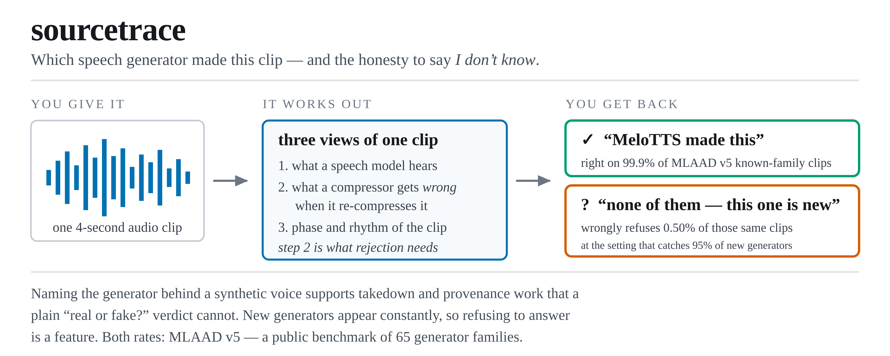

<p align="center">
  <picture>
    <source media="(prefers-color-scheme: dark)" srcset="assets/readme/hero-dark.png">
    
  </picture>
</p>

# sourcetrace

*CoRA: Robust Open-Set Audio Deepfake Attribution with Neural Codec Residuals*


[](https://huggingface.co/RootAccess4Life/ood-source-tracing)

> 📦 Checkpoint: **[RootAccess4Life/ood-source-tracing](https://huggingface.co/RootAccess4Life/ood-source-tracing)**
> — one file, [`mlaad_v5.pt`](https://huggingface.co/RootAccess4Life/ood-source-tracing/blob/main/mlaad_v5.pt),
> is the artifact of record for every number below, on both corpora.
> It is sha256-pinned in `scripts/download_weights.py`; fetch with
> `python scripts/download_weights.py`.

**Given a synthetic speech clip, name which synthesis model produced it — or report
that the model is not one it has seen.** That second answer is the point: new systems
appear constantly, and an attribution nobody can trust is worse than none.

A **frozen** WavLM-Large front end (layers 1–4, mean|std pooled), no fine-tuning, a
52-d spectral phase/modulation signature, and a small trained head. The distinguishing
ingredient is a **codec reconstruction residual**: squeeze a clip through EnCodec-24 kHz,
pull it back, and keep what it got *wrong*. Those 33 numbers come off the waveform the
speech model never sees; a trained projection folds them into the embedding.

The head produces **one 288-d embedding** `z = L2([z_ssl ‖ 0.1 z_spec ‖ 0.5 z_codec])`,
and everything reads it: an anchor-margin plus relative-Mahalanobis score decides
known against unseen, the nearest trained anchor names the model, and the same `z`
scores STOPA by cosine to enrolment fingerprints, **without any STOPA training**.

**FPR95 0.50 % against a published 3.36 % · OOD-EER 2.45 % · known-model accuracy
99.86 % · STOPA held-out model EER 6.80 % with no retraining.** The residual channel is
worth 0.78 FPR95 points and 1.0 OOD-EER points on MLAAD v5 and 1.3 EER points on STOPA
([table](#results)).

```bash
git clone https://github.com/pujariaditya/CoRA && cd CoRA
conda create -n sourcetrace python=3.10 && conda activate sourcetrace
pip install -e . && ./setup.sh
python scripts/smoke.py              # 20 s, no download: check the install
```

Export `PYTHONNOUSERSITE=1` in that environment — a newer `huggingface_hub` in
`~/.local` shadows the pinned one and breaks the pinned `transformers`. Run from the
repository root; every entry point checks the interpreter first and says so when it is
wrong.

`smoke.py` exercises fit → embed → open-set score → attribute → save → reload on a tiny
synthetic matrix, so a broken install fails in seconds instead of after a 242 GB
download. It says nothing about accuracy; `./scripts/verify_results.sh` is what does.

## Results

On **MLAAD v5**, synthesis-model-held-out open set: 65 known models, 9,620 evaluation
utterances (4,375 known-model, 5,245 held-out-model), split seed 42 / fit seed 0.

| metric | this repo | published |
|---|---|---|
| FPR95 ↓ | **0.50 %** | 3.36 % |
| OOD-EER ↓ | 2.45 % | — |
| known-model accuracy ↑ | 99.86 % | — |

The published reference is Neamtu et al.
([arXiv:2606.10758](https://arxiv.org/abs/2606.10758), proxy-anchor metric learning on
Wav2Vec2-BERT) under the same FPR95 definition:
the threshold is set on the OOD development set so that 95 % of unseen-model utterances
are detected, and FPR95 is the fraction of known-model evaluation utterances it falsely
detects as unseen. They report no OOD-EER or attribution accuracy, which is why those
rows have no reference rather than a favourable one.

**The codec channel is worth 0.78 FPR95 points and 1.0 OOD-EER points.** Deleting it
moves FPR95 from 0.50 to 1.28, OOD-EER from 2.45 to 3.45 and known-model accuracy from
99.86 to 99.68 (`results/ablation/no_codec.json`); the known-model confusions go from
6 to 14 of 4,375. The projection that folds the 33 residual features into the embedding
is trained with the head; leaving it at its random initialisation, the earlier design,
costs 0.28 FPR95 points and 0.9 OOD-EER points (`results/ablation/fixed_proj.json`).
Removing the spectral signature, the gating, or one of the two scoring terms moves
FPR95 by at most 0.48 points (`results/ablation/`).

**The SSL layer band matters and is chosen on development data.** Layers 1–4 score 0.50
FPR95 against 0.91 for 4–7 and 1.58 for 8–11, and the development split orders the bands
the same way (OOD-EER 1.95 / 2.11 / 3.16), so the choice does not read the evaluation
split (`results/layer_band_summary.json`).

The conformal abstention rule reports its measured coverage against the 95 % nominal
level in `results/reliability.json`.

On **STOPA** — a second corpus, its released split and cosine-scoring protocol, 33,200
enrolment and 629,800 probe utterances — the **same checkpoint is applied without
retraining**: no STOPA utterance is used for training, and enrolment utterances only
form the fingerprint of each synthesis model. It scores **6.80 %** EER for held-out
synthesis models and 9.24 % for known ones; for vocoder attribution 7.81 % (held-out)
and 3.86 % (known). Without the codec channel the held-out EER rises to 8.08 %
(`results/stopa_measured.json`, `results/ablation/no_codec.json`). STOPA's own trained
baselines report 35.34 % (ASVspoof-trained AASIST), 47.75 % (STOPA-trained AASIST) and
49.55 % (ResNet-34). **No margin is claimed over the 16.43 % zero-shot EER** of Chhibber
et al.: it uses a different data split, and `evaluate` prints `n/c` rather than a win.

Every number here is single-seed; the paper reports the spread over five training seeds.

## Reproduce the table

```bash
python scripts/download_weights.py                        # the head, sha256-pinned
python scripts/fetch_mlaad.py                             # ~242 GB of audio
bash scripts/fetch_stopa.sh                               # STOPA from Zenodo
python -m sourcetrace.extract --dataset mlaad_v5          # audio -> 2133-d features
python -m sourcetrace.extract --dataset stopa             # enrolment + probes only
python -m sourcetrace.evaluate --task both \
    --checkpoint checkpoints/mlaad_v5.pt --json runs/my_run.json
```

Write your own runs to `runs/`, not `results/` — that directory is the committed
record the paper cites, and a re-run that overwrote it in place would leave no way to
tell a reproduction from the original.

Downloading the checkpoint saves the ~15–40 minute fit and nothing else; evaluation
still reads the feature caches built above. To refit instead, drop `--checkpoint`, or
use `python -m sourcetrace.train --checkpoint checkpoints/mlaad_v5.pt`; the fit is
deterministic at split seed 42 / fit seed 0 and reproduces `results/ablation/full.json`
exactly. `./scripts/verify_results.sh` runs the whole chain end to end, and
`./scripts/run_ablations.sh` reproduces the ablation table (one fit per arm).

Paths are environment-driven, never hardcoded: `ST_DATA_ROOT`, `ST_MLAAD_ROOT`,
`ST_STOPA_ROOT`, `ST_FEATURE_CACHE`, `ST_MODEL_CACHE`, and `ST_CPU=1` to force CPU.
Hyperparameters come from `configs/` — `configs/base.yaml` is the frozen configuration
and is checked to be identical to the code's own defaults; each `configs/ablation_*.yaml`
overrides one thing.

## Citation

See [`CITATION.cff`](CITATION.cff). Please also cite the benchmarks — MLAAD
([mueller91/MLAAD](https://huggingface.co/datasets/mueller91/MLAAD)) and STOPA
([10.5281/zenodo.15606628](https://doi.org/10.5281/zenodo.15606628)) — and the
baselines compared against: Neamtu et al.
([arXiv:2606.10758](https://arxiv.org/abs/2606.10758)) and Chhibber et al.
([arXiv:2509.24674](https://arxiv.org/abs/2509.24674)).

## Licence

MIT (`LICENSE`). MLAAD and STOPA carry their own terms; this repository redistributes
no audio and no weights.
